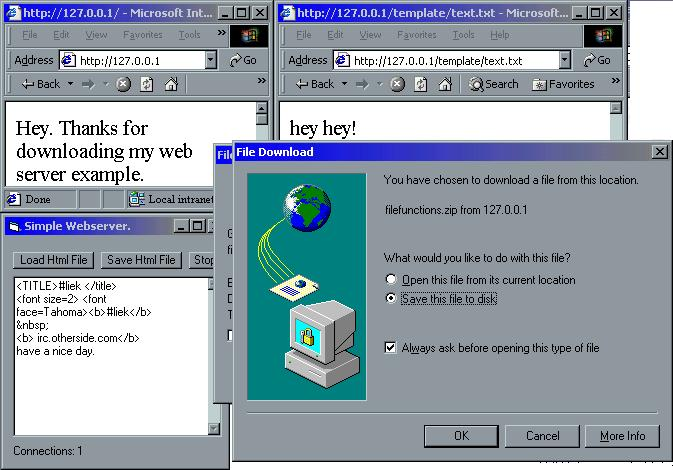



## a simple web server\.

### Description

This is an example of a webserver. Very simple, supports images and files, 404 errors, and supports index files (index.html as default file) .
 
### More Info
 

             |
---                |---
**Submitted On**   |2001-08-24 19:00:42
**By**             |[ttb](https://github.com/Planet-Source-Code/PSCIndex/blob/master/ByAuthor/ttb.md)
**Level**          |Intermediate
**User Rating**    |4.2 (71 globes from 17 users)
**Compatibility**  |VB 6\.0
**Category**       |[Internet/ HTML](https://github.com/Planet-Source-Code/PSCIndex/blob/master/ByCategory/internet-html__1-34.md)
**World**          |[Visual Basic](https://github.com/Planet-Source-Code/PSCIndex/blob/master/ByWorld/visual-basic.md)
**Archive File**   |[a simple w252948242001\.zip](https://github.com/Planet-Source-Code/ttb-a-simple-web-server__1-26621/archive/master.zip)

